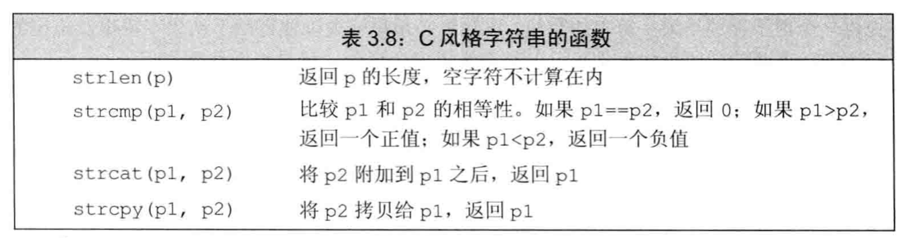

<h1 align="center">第三章 字符串、向量和数组 学习笔记</h1>

👉 【[练习题]()】

- [1. 命名空间的`using声明`](#1-命名空间的using声明)
- [2. 标准库类型 `string`](#2-标准库类型-string)
  - [2.1 定义和初始化string对象](#21-定义和初始化string对象)
  - [2.2 string对象上的操作](#22-string对象上的操作)
  - [2.3 处理string对象中的字符](#23-处理string对象中的字符)
- [3. 标准库类型 `vector`](#3-标准库类型-vector)
  - [3.1 定义和初始化vector对象](#31-定义和初始化vector对象)
  - [3.2 向vector对象中添加元素](#32-向vector对象中添加元素)
  - [3.3 其他vector操作](#33-其他vector操作)
- [4. `迭代器`介绍](#4-迭代器介绍)
  - [4.1 使用迭代器](#41-使用迭代器)
  - [4.2 迭代器运算](#42-迭代器运算)
- [5. `数组`](#5-数组)
  - [5.1 定义和初始化内置数组](#51-定义和初始化内置数组)
  - [5.2 访问数组元素](#52-访问数组元素)
  - [5.3 指针和数组](#53-指针和数组)
  - [5.4 C风格字符串](#54-c风格字符串)
  - [5.5 旧代码接口](#55-旧代码接口)
- [6. `多维数组`](#6-多维数组)
  - [6.1 多维数组的初始化](#61-多维数组的初始化)
  - [6.2 使用范围for语句处理多维数组](#62-使用范围for语句处理多维数组)
  - [6.4 指针和多维数组](#64-指针和多维数组)

## 1. 命名空间的`using声明`
使用`using声明`后，无须专门前缀（如`命名空间::`）也可使用所需的名字。
```cpp
using namespace::name;
```
- `每个名字`都需要独立的`using声明`
    - 每个`using声明`引入命名空间中的一个成员。
    - 用到的每个名字都必须有自己的声明语句，而且每句话都以`分号`结束。

- `头文件`不应包含`using声明`
    - 位于头文件的代码，一般来说不应该`使用using声明`。


## 2. 标准库类型 `string`
标准库类型 string 表示可变长的字符序列，使用string类型必须首先包含string头文件。string定义在命名空间std中。

```cpp
#include <string>
using std::string;
```

### 2.1 定义和初始化string对象
如何初始化类的对象是由`类本身`决定的。一个类可以定义很多`初始化对象`的方式。


- `直接初始化`和`拷贝初始化`
  - `直接初始化`：使用`等号（=）`初始化一个变量。
    - 编译器把等号右侧的初始值拷贝到新创建的对象中去。
  - `拷贝初始化`：`不使用等号`

```cpp
string s1 = "SolerHO";  // 拷贝初始化
string s2("SolerHO");   // 直接初始化
string s3(10,'c');      // 直接初始化，s3的值是：cccccccccc
```
- 当初始值只有一个时，使用直接初始化或者拷贝初始化都行。

- 对于用多个值进行初始化的情况，非要拷贝初始化的方式处理

### 2.2 string对象上的操作


- 读写string对象

  - 在执行`读取操作`时，string对象会`自动忽略开头的空白`（即`空格符、换行符、制表符`等）并从第一个真正的字符开始读起，直到遇见`下一处空白`为止。

- 读取未知数量的string对象
  
  ```cpp
  int main()
  {
    string word;
    while (cin >> word)
        cout << word << endl;
    return 0;
  }
  ```

- 使用`getline()` 读取一整行

  - `getline()` 函数的参数是一个`输入流`和一个`string对象`。
  - `getline()` 函数从给定的输入流中读入内容，直到换行符为止（注意不存在换行符）。
  - `getline()` 只要一遇到换行符就结束读取操作并返回结果。
  - `getline()` 会返回它的流参数
  - 触发`getline()` 函数返回的那个`换行符`实际上`被丢弃`，得到的`string对象`中并不包含该换行符。

- string的 `empty` 和 `size` 操作
  
  - `empty` 函数根据string对象`是否为空`返回一个对应的`布尔值`。
  - 使用`点操作符`指明`对象`。
  - `size` 函数返回`string对象`的`长度`（即string对象中字符的`个数`）。
  - 使用`size函数`只输出长度`超过80个字符的行`。

- `string::size_type` 类型

  - `size` 函数返回的是一个`string::size_type` 类型的值。
  - 在C++11新标准中，允许编译器通过`auto`或者`decltype` 来推断变量的类型。
  - `size()` 函数返回的是一个`无符号整型数`。
  - `size()` 函数尽量不要使用`int`，避免混用`int`和`unsigned`带来的问题。

- 比较string对象

  - 两个string对象的`长度不同`，`较短`string对象的每个字符都与`较长`string对象对应位置上的`字符相同`。较短string对象小于较长string对象。
  - 两个string对象长度在某些对应的`位置不一致`。返回的结果是：第一对`相异字符`比较的结果。

- 为string对象赋值

  - 对于string类来说，允许把`一个对象的值`赋给`另外一个对象`。

- 两个string对象相加

  - 对象相加`相加`得到一个新的string对象（将左右两侧的运算对象`串接`而成）。
  
  ```cpp
  string s1 = "hello, ", s2 = "world \n";
  string s3 = s1 + s2; 
  ```

- 字面值和string对象相加

  - 标准库允许把`字符字面值`和`字符串字面值`转换成`string对象`。
  - 当把`string对象`和`字符字面值`及`字符串字面`值混在一条语句使用时，必须确保每个`加法运算符（+）`的两侧运算对象至少有一个是`string`。

  ```cpp
  string s1 = "hello, ", s2 = "world \n";
  string s3 = s1 + "," + s2 + '\n'; 
  cout << s3 << endl;
  return 0;
  ```

### 2.3 处理string对象中的字符


- 处理每个字符？使用基于范围的`for语句`
  - 使用C++11新标准的一种语句：`范围for（range for）语句`。语法格式：
  
    ```cpp
    // expression 部分是一个对象，用于表示一个序列
    // declaration 部分负责定义一个变量，用于访问序列中的基础元素
    for (declaration : expression)
        statement;
    // 每次迭代，declaration部分的变量会被初始化为expression部分下一个元素值
    int main()
    {
      string s1 = "Hello";
      for (auto c : s1) {
        cout << c << " ";
      }
      cout << endl;
      return 0;
    }
    ```

- 处理每个字符？使用范围for语句改变字符串中的字符

  - 使用引号

  ```cpp
  string s1 = "Hello";
  for (auto& c : s1) {
    c = toupper(c);
  }
  cout << s1 << endl;
  ```

- 下标运算符（`[ ]`）
  - 接收的输入参数是string::size_type 类型的值，参数表示要访问的字符的位置，返回值是该位置上字符的引用。
    - 如果string对象s至少包含两个字符，则`s[0]` 是第1个字符、`s[1]` 是第2个字符、`s[s.size()-1]`是最后一个字符。

  - string对象的下标必须`大于等于0而小于s.size()`
  - `超出范围`的下标将引发`不可预知`的结果。
  - 如果`s`为空，则`s[0]`的结果将是`未定义`的。在使用指定字符之前，首先检查s是否为空。

## 3. 标准库类型 `vector`
标准库类型 vector 表示对象的集合，其中所有对象的类型都相同。

集合中的每个对象都有一个与之对应的索引，索引用于访问对象。称为 **`容器（container）`** 。

C++既有`类模板`，也有`函数模板`，其中`vector`是一个`类模板`。

`模板`本身不是`类或函数`，可以把模板看作为`编译器生成类`或`函数编写的一份说明`。

编译器根据`模板创建类`或`函数`的过程称为 **`实例化（instantiation）`**，当使用模板时，需要指出编译器应把`类`或`函数实例化`成何种类型。

### 3.1 定义和初始化vector对象


可以允许一个`vector对象`的元素`拷贝`给另一个`vector对象`。
> 新vector对象的元素是原vector对象对应元素的副本。

```cpp
vector<int> ivec;  // 初始状态为空
vector<int> ivec2(ivec); // 把ivec的元素拷贝给ivec2
vector<int> ivec3(ivec); // 把ivec的元素拷贝给ivec3
vector<string> svec(ivec2); // 错误：svec的元素是string对象，不是int 
```
> 注意两个vector对象的类型`必须相同`。

C++11 提供vector对象的元素赋初值的方法，即`列表初始化`。

```cpp
vector<string> articles = {"a","an","the"}; // vector包含3个元素
```

C++提供的初始化方式：
- 使用`拷贝初始化`时（使用`=`时）

- `类内初始值`，使用`拷贝初始化`或使用`花括号`的`形式初始化`

- 提供初始元素值的`列表`，则只能把`初始值`都放在`花括号`里进行`列表初始化`。

创建指定数量的元素

```cpp
vector<int> ivec(10,-1); // 10 个int类型的元素，每个都初始化为-1
```

值初始化

```cpp
vector<int> ivec(10); // 10个元素，每个都初始化为0
```

### 3.2 向vector对象中添加元素
先创建一个空的vector，再利用vector的成员函数`push_back()` 向其中添加元素。负责把一个值当成vector对象尾元素“`压到（push）`”vector对象的“`尾端（back）`”

如果循环体内部包含有向vector对象添加元素的语句，则不能使用范围for循环。
> for语句体内不应该改变其所遍历序列的大小。

### 3.3 其他vector操作


vector的`empty`和`size`两个成员
- `empty` 检查vector对象是否包含元素然后返回一个`布尔值`。
- `size` 则访问vector对象中`元素的个数`，`返回值的类型`是由vector定义的`size_type`类型。

`vector 对象`（以及string对象）的`下标运算符`可用于`访问已存在`的元素。而不是`用于添加元素`。


## 4. `迭代器`介绍
迭代器提供了对`对象`的`间接访问`。就迭代器而言，其对象是`容器中的元素`或`string对象中的字符`。

### 4.1 使用迭代器
- `begin()` 成员负责返回指向第一个元素（或第一个字符）的迭代器。
- `end()` 成员则负责返回指向容器（或string）`尾元素的下一位置`的迭代器。迭代器指向的是容器的一个`本不存在的“尾后”元素`，存在意义：`标记`，称为`尾后迭代器`。
- 如果容器为空，则`begin` 和`end`返回的同一个迭代器，都是`尾后迭代器`。

- 迭代器通过`解引用`来获取所指示的元素。执行解引用的迭代器必须合法并确实指示某个元素。


迭代器使用`递增（++）运算符`来从一个元素`移动`到下一个元素。

- 如果`vector对象`或`string对象`是一个`常量`，只能使用`const_iterator`
- 如果`vector对象`或`string对象` **`不是常量`** ，既可使用`iterator`也能使用`const_iterator`。
  

`begin` 和 `end`运算符
- `begin` 和 `end` 返回的具体类型由`对象是否是常量`决定。
- 如果对象`是常量`，`begin` 和 `end` 返回 `const_iterator`
- 如果对象`不是常量`，返回 `iterator`
- 在C++11中引入了新函数：`cbegin()` 和 `cend()`。

```cpp
vector<int> v;
const vector<int> cv;
auto it1 = v.begin();  // it1 的类型是 vector<int>::iterator
auto it2 = cv.begin(); // it2 的类型是 vector<int>::const_iterator
auto it3 = v.cbegin(); // it3 的类型是 vector<int>::const_iterator
```

C++定义了`箭头运算符（->）`，箭头运算符把`解引用`和`成员访问操作`结合在一起。`it->mem` 和 `(*it).mem` 表达是一样的。

> 必须加上圆括号，优先级问题。

```cpp
for (auto it = text.cbegin(); it != text.cend() && !it->empty(); it++)
  cout << *it << endl;
```

但凡是使用了迭代器的循环体，都不要向迭代器所属的容器添加元素。

### 4.2 迭代器运算


- 参与比较的两个迭代器必须合法而且指向的是同一个容器的元素（或者尾元素的下一个位置）。
- 距离：右侧的迭代器向前`移动多少位置`就追上左侧的迭代器，其类型名为 `difference_type` 的带符号整型数。

使用迭代器实现的二分搜索
```cpp
// text 必须是有序的
// beg 和 end 表示我们搜索的范围
auto beg = text.begin(), end = text.end();
auto mid = text.begin() + (end - beg) / 2; // 初始状态下的中间点

// 查找目标值 sought
while (mid != end && *mid != sought)
{
  if (sought < *mid)
    end = mid; //  调整搜索范围，使得忽略掉后半部分
  else
    beg = mid + 1;  // 在mid之后查找
  mid = beg + (end - beg) / 2; // 更新新的中间点
}
```

## 5. `数组`
数组是类似于vector的数据结构。

数组是存放类型相同的对象的容器，对象本身没有名字，需要通过其所在位置访问。数组的大小确定不变，不能随意向数组中增加元素。

### 5.1 定义和初始化内置数组
- 数组是一种复合类型
- 数组的声明形式，如`a[d]`，其中a是数组的名，d是数组的维度（必须是 **`常量表达式`**：`const int x = 4`）。维度说明了数组中元素的个数。
- 默认情况下，数组的元素是默认初始化的。
- 定义数组时，必须指定数组的类型，~~不允许使用 auto 关键字由初始值的列表推断类型~~。

初始化时的注意事项：
- 如果在数组中没指明维度，编译器会根据初始值的数量计算并推测出来。
- 如果指明了维度，初始值的总数量不可以超出指定的大小。
- 如果维度比提供的初始值数量大，则提供的初始值初始化考前的元素，剩下的元素被初始化成默认值。

```cpp
const unsigned sz = 3;
int ia1[sz] = {0,1,2};
int a2[] = {0,1,2}; // 未指定维度，编译器自动推断并计算
int a3[5] = {0,1,2}; // a3[5] = {0,1,2,0,0};
string a4[3] = {"hi","bye"}; // 等价于 a4[] = {"hi", "bye",""};
int a5[2] = {0,1,2}; // 初始值超出指定大小，错误
```
对于字符数组来说，可以使用字符串字面值来初始化。
- 在字符串字面值的结尾处会有一个空字符。

不能将数组的内容拷贝给其他数组作为初始值，也不能使用数组为其他数组赋值。
- 一般会提示，表达式必须是可修改的左值。

### 5.2 访问数组元素
- 在使用`数组下标`时，通常将其定义为 `size_t类型`，`size_t` 是一种机器相关的`无符号类型`。被设计得可以表示内存中`任意对象的大小`。在`cstddef头文件`中定义了`size_t`类型。


需要`遍历数组`的所有元素时，最好的办法也是使用 `范围for循环`。

```cpp
for (auto i : scores) // 不确定元素个数，使用范围for语句可以减轻人为控制遍历过程的负担
  cout << i << " ";
cout << endl;
```

数组的下标是否在合理范围之内由程序员负责检查。防止数组的下标越界。
> 下标应该大于等于0 且 小于数组的大小。

主要的常见问题是 **`缓冲区溢出错误`**。当数组或其他类似数据结构的下标越界并试图访问非法内存区域时，就会产生此类错误。

### 5.3 指针和数组
使用数组时，编译器一般会把它转换成指针。

通常情况下，使用`取地址符`来获取`指向某个对象的指针`。`取地址符`可以用于`任何对象`。

```cpp
string nums[] = {"one","two","three"}; // 数组的元素是string对象
string *p = &nums[0]; // p指向nums的第一个元素
string *p2 = nums; // 等价于 p2 = &nums[0]，编译器会自动将 nums 转换为首元素的地址
```

指针也是一个迭代器。

在C++11中引入两个函数（不是成员函数）：`begin` 和 `end`。函数定义在`iterator头文件`中。

```cpp
int ia[] = {0,1,2,3,4,5,6,7,8,9}; // ia是一个含有10个整数的数组
int *beg = begin(ia); // 指向ia首元素的指针
int *last = end(ia); // 指向arr尾元素的下一个位置的指针
```
给一个指针`加上（或减去）`整数值，结果仍是指针。

```cpp
auto n = end(arr) - begin(arr); // 
```

两个指针`相减`的结果是一种名为 `ptrdiff_t` 的标准库类型。因`差值`可能是`负值`，所以是`ptfdiff_t` 是一种`带符号类型`。

如果p是`空指针`，允许给`p加上或减去`一个值为0的`整型常量表达式`。

### 5.4 C风格字符串
`字符串字面值`是一种通用结构的实例。从C继承而来的C风格字符串。

`字符串`存放在`字符数组`中并以 **`空字符结束`**。一般使用 `指针` 来操作字符串。


- C标准String函数定义在`cstring头文件`中。

  

- 比较字符串
  - 使用 `strcmp` 函数。
  - 如果两个字符串`相等`，strcmp返回`0`。
  - 如果`前面`的字符串较大，则返回`正值`。
  - 如果`后面`的字符串较大，返回`负值`。

### 5.5 旧代码接口
允许使用字符串字面值来初始化string对象。
```cpp
string s("hello world");
```

任何出现`字符串字面值`的地方都可以用以`空字符结束`的`字符数组`来替代。
- 允许使用以`空字符结束`的`字符数组`来初始化`string对象`或为`string对象赋值`。
- 在string对象的`加法运算`中允许使用以`空字符结束`的字符数组作为其中`一个运算对象`（不能两个运算对象都是）
- 在string对象的`复合赋值运算`中允许使用以`空字符结束`的`字符数组`作为`右侧的运算对象`。

⚠️注意：反过来不成立。

string提供了一个`c_str`的成员函数，返回值是一个`C风格的字符串（一个指针）`。
```cpp
string s;
const char *str = s.c_str();
```

- 使用数组初始化vector对象
  - ~~不允许使用一个数组为另一个内置类型的数组赋初值~~
  - ~~不允许使用 vector对象初始化数组~~。
  - 允许使用数组来初始化vector对象。

  ```cpp
  int int_arr[] = {0,1,2,3,4,5};
  vector<int> ivec(begin(int_arr),end(int_arr));
  ```

## 6. `多维数组`
严格来说，C++语言中没有多维数组。多维数组其实是数组的数组。

对于二维数组来说，第一个维度值为行，第二个维度值为列。
```cpp
int ia[2][3]; // 2行3列
```

### 6.1 多维数组的初始化
多维数组的每一行分别用花括号括起来。

```cpp
int ia[3][4] = { // 3个元素，每个元素大小为4的数组
  {0,1,2,3},  // 第1行的初始值
  {4,5,6,7};  // 第2行的初始值
  {8,9,10,11} // 第3行的初始值
}
```

对于未列出的元素执行默认值初始化。

### 6.2 使用范围for语句处理多维数组
C++11中新增`范围for语句`。

```cpp
size_t cnt = 0;
for (const auto &row : ia) // 因为row不是引用类型，编译器会自动初始化row为指针形式。所以加引用，可以避免数组自动转换成指针。
  for (auto &col : row){ 
    col = cnt;
    ++cnt;
  }
```

### 6.4 指针和多维数组

在C++11中提出，通过使用`auto`或者`decltype`可`避免`在`数组名前面`加上一个`指针类型`。

在声明中，圆括号不可少。
```cpp
int *ip[4];   // 整型指针的数组
int (*ip)[4]; // 指向含有4个整数的数组
```

