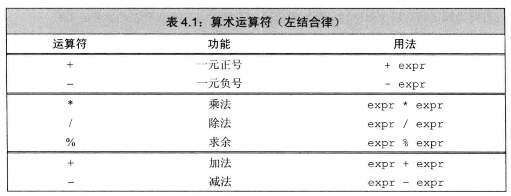
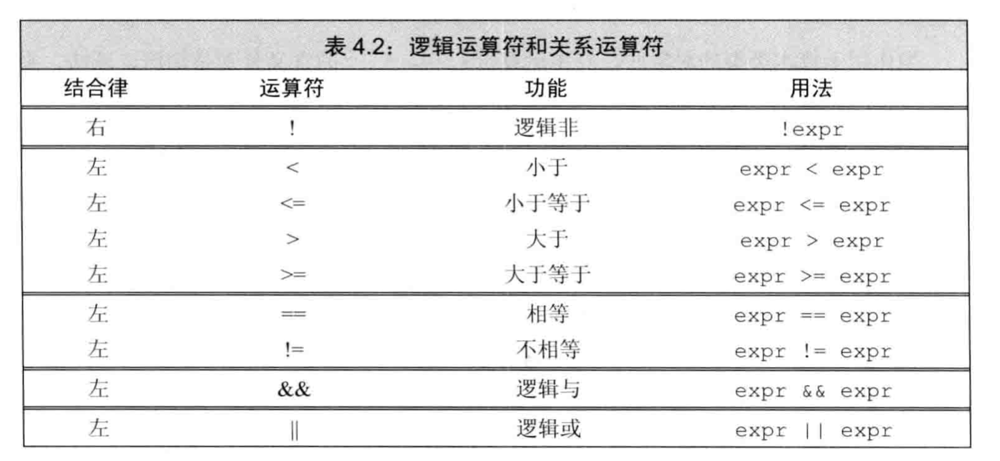
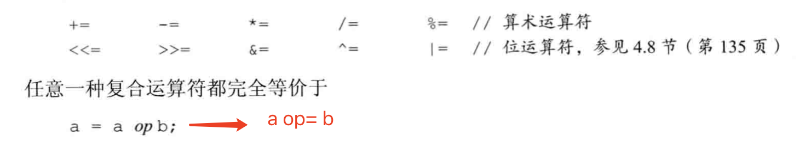
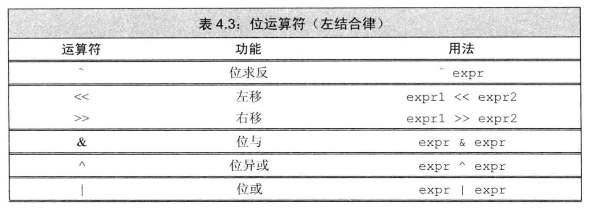

<h1 align="center">第四章 表达式 学习笔记</h1>

- [1. 基础](#1-基础)
  - [1.1 基本概念](#11-基本概念)
  - [1.2 优先级与结合体](#12-优先级与结合体)
  - [1.3 求值顺序](#13-求值顺序)
- [2. 算术运算符](#2-算术运算符)
- [3. 逻辑和关系运算符](#3-逻辑和关系运算符)
- [4. 赋值运算符](#4-赋值运算符)
- [5. `递增（++）`和`递减（--）`运算符](#5-递增和递减--运算符)
- [6. 成员访问运算符](#6-成员访问运算符)
- [7. 条件运算符](#7-条件运算符)
- [8. 位运算符](#8-位运算符)
- [9. sizeof运算符](#9-sizeof运算符)
- [10. 逗号运算符](#10-逗号运算符)
- [11. 类型转换](#11-类型转换)
  - [11.1 发生隐式类型转换的情况](#111-发生隐式类型转换的情况)
  - [11.2 算术转换](#112-算术转换)
  - [11.3 其他隐式类型转换](#113-其他隐式类型转换)
  - [11.4 显式转换](#114-显式转换)
- [12. 运算符优先级表](#12-运算符优先级表)

## 1. 基础
- `表达式`由一个或多个`运算对象（operand）`组成，对`表达式求值`得到一个`结果`。

- `字面值`和`变量`是最简单的`表达式`，其结果也是`字面值`和`变量的值`。

### 1.1 基本概念
C++定义了3个类型的运算符：
- `一元运算符（unary operator）`：作用于一个运算对象。
  - `取地址符（&）`
  - `解引用符（*）`
- `二元运算符（binary operator）`：作用于两个运算对象。
  - `相等运算符（==）`
  - `乘法运算符（*）`
- 三元运算符：三个运算对象。

在`表达式求值`的过程中，`运算对象`常常由`一种类型`转换成`另一种类型`。

C++11语言定义了运算符作用于`内置类型`和`复合类型`的运算对象时所执行的操作。

**`重载运算符`**：在已存在的运算符赋予另外一层含义。如：IO库的`>>` 和 `<<`。

在使用`重载运算符`时，其包括`运算对象的类型`和`返回值的类型`，都是该由运算符定义的。

- 左值和右值
  - `左值`可以位于赋值语句的`左侧`，`右值`则不能。
  - `左值表达式`的求值结果是一个`对象`或者一个`函数`。
  - 当一个对象被`用作右值`时，用的是`对象的值（内容）`。
  - 当对象被`用作左值`时，用的是`对象的身份（在内存中的位置）`。
  
一个重要的原则：
- 在需要`右值`的地方可以用`左值`来代替，但~~不能把右值当成左值（位置）使用~~。
- 当一个`左值`被当成`右值`使用时，实际使用的是`它的内容（值）`。

使用左值作为左侧运算对象的运算符总结：
- **`赋值运算符`**：返回一个左值
- **`取地址符`**：返回一个指向该运算对象的指针，指针为右值。
- **`内置解引用运算符`**：求值结果为左值。
- **`下标运算符`**：求值结果为左值。
- **`迭代器解引用运算符`**：求值结果为左值。
- **`string和vector的下标运算符`**：求值结果为左值。
- **`内置类型`**：前置版本所得结果为左值。
- **`迭代器的递增递减运算符`**：前置版本所得结果为左值。

使用`decltype`时，左值和右值不同：
- 使用`左值`时，结果为`左值`，decltype作用于该表达式（不是变量）得到一个`引用类型`。
- 因`取地址运算符`生成`左值`，所以`decltype(&p)` 的结果是`int**`。结果是一个`指向整型指针的指针`。

### 1.2 优先级与结合体
**`复合表达式（compound expression）`**：指包含有`两个`或`多个`运算符的`表达式`。由`优先级`决定运算对象组合的方式。

括号无视普通的组合规则。

### 1.3 求值顺序
优先级规定了运算对象的组合方式。运算对象的求值顺序与优先级和结合律无光。

处理复合表达式的方式：
- 不确定时，直接使用括号来强制让表达式的组合关系复合程序逻辑的要求。
- 如果改变了某个运算对象的值，在表达式其它地方不要使用该运算对象。

## 2. 算术运算符


- 一元运算符的优先级最高。
- 算术运算符的运算对象和求值都是右值。
- 一元正号运算符、加法运算符和减法运算符都能作用于指针。
- 当`一元正号运算符`作用于一个`指针`或`算术值`时，返回`运算对象值`的一个`副本`。
- `一元负号运算符`对`运算对象值取负`后，返回其`副本`。
- `取余`的两个运算对象`必须是整数类型`。

## 3. 逻辑和关系运算符
- `关系运算符`作用于`算术类型`或`指针类型`。
- `逻辑运算符`作用于任意能转换成`布尔值的类型`。
- `逻辑运算符`和`关系运算符`的`返回值`都是`布尔类型`。
- 值为`0`的`运算对象（算术类型或指针类型）`表示`假`，否则表示`真`。
- `运算对象`和`求值结果`都是`右值`。



- **`短路求值（short-circuit evaluation）`** 策略：逻辑与运算符和罗或运算符都是先求左侧运算对象的值再求右侧运算对象的值，当且仅当左侧运算对象确定表达式的结果时才会计算右侧运算对象的值。

如果要测试一个算术对象或指针对象的真值，最直接的方式就是if语句的条件：
```cpp
if (val) {/* ... */}   //  如果val是任意的非0值，条件为真
if (!val) {/* ... */}  // 如果val是0，条件为真
```

进行`比较运算符`时除非比较的对象是`布尔类型`，否则不要使用`布尔字面值true`和`false`作为`运算对象`。


## 4. 赋值运算符
- `赋值`运算符的`左侧运算对象`必须是一个`可修改的左值`。
- C++11 新标准允许使用`花括号`起来的`初始值列表`作为赋值语句的`右侧运算对象`。
- 切勿混淆相等运算符和赋值运算符
  ```cpp
  // 相等运算符
  if (i = j)
  // 赋值运算符
  if (i == j)
  ```
- 赋值运算符优先级较低
  - 因为赋值运算符的优先级低于关系运算符的优先级，所以在条件语句中，赋值部分通常是应该加上括号。

- 复合赋值运算符
  
  

  - 区别：左侧运算对象的`求值次数`
  - 使用`复合运算符只求值一次`，使用`普通运算符`则`求值两次`。

## 5. `递增（++）`和`递减（--）`运算符
进行加1或减1操作。

- 可应用于迭代器
- 必须作用于左值运算符

分为两个形式：
- `前置`版本：对象本身作为`左值返回`。
  - 
- `后置`版本：将对象的`原始值的副本`作为`右值返回`。
  - 

```cpp
int i = 1; j;
j = ++i; // 先递增，再赋值
j = i++; // 先赋值，再递增
```

✅ 建议：除非必须，否则`不用递增递减`运算符的`后置`版本。

`后置递增`运算符的优先级高于`解引用`运算符。


## 6. 成员访问运算符
`点运算符`和`箭头运算符`都可`访问成员`。

- 点运算符`获取类对象`的一个成员：表达式 `ptr->mem` 等价于 `(*ptr).mem`。

`解引用`运算符的优先级低于`点运算符`。所以执行`解引用运算符的子表达式`两端必须加上`括号`。

箭头运算符作用于一个指针类型的运算对象，结果是一个左值。

`点运算符`分为两种情况：
- 成员所属的对象是`左值`，则结果是`左值`。
- 成员所属的对象是`右值`，则结果是`右值`。

## 7. 条件运算符
语法格式：

```cpp
cond ? expr1 : expr2
// cond 判断条件的表达式
// expr1 和 expr2 是两个类型相同或者可能转换为某个公共类型的表达式

// 示例：判断成绩是否合格
string finalgrade = (grade < 60) ? "fail" : "pass";
```
执行过程：先求cond的值，如果为真，则对expr1求值并返回值，否则对expr2求值并返回值。

- 可进行嵌套，但是层数增加，会导致可读性下降，所以最好不要超过3层。


## 8. 位运算符
`位运算符`作用于整数类型的`运算对象`，并把运算对象看成`二进制位`的`集合`。

> 位运算符提供检查和设置二进制位的功能。bitset标准库类型可表示任意大小的二进制位集合。



- **`位求反`** 运算符
  - 将运算符`逐位求反`后生成一个新值。
  - 将1置为0，将0置为1。

- **`移位运算符`**
  - 又叫`IO运算符`。原因：重载了IO符号。
  - 满足`结合律`。
  - 将二进制位`整体左移（右移）`指定`位数`，`低位用0补齐`。

- **`位与`**、**`位或`**、**`位异或`** 运算符
  - `位与（&）`：两个运算对象的对应位置`都是1`，结果才为1，否则为0。
  - `位或（|）`：两个运算对象的对应位置`其中有一个为1`，则结果为1，否则为0。
  - `位异或（^）`：如果两个运算对象的`对应位置有且只有一个为1`，则结果中的该位为1，否则0。

## 9. sizeof运算符
- sizeof() 返回`一条表达式`或一个`类型名`所占的`字节数`。
- 语法格式：
  ```cpp
  sizeof (type)
  sizeof expr // 返回表达式结果类型的大小
  ```

sizeof运算符的结果部分依赖于其作用的类型：
- `char`和`char类型的表达式`，结果为`1`
- `引用类型`，结果为`被引用对象所占空间的大小`。
- `指针`，结果为`指针本身所占空间的大小`。
- `解引用指针`，结果为`指针指向的对象所占空间的大小`，指针可无效。
- `数组`，结果为`整个数组所占空间的大小`。
  - ⚠️注意：~~sizeof不会把数组转换成指针来处理~~。
  - 等价于`数组所有元素`各执行一次sizeof并`求和`。

- `string对象`或`vector对象`，结果为`该类型固定的大小`，不会计算对象中的元素占用的空间。

## 10. 逗号运算符
含有两个运算符，按从左往右的顺序一次求值。规定了运算对象求值的顺序。

## 11. 类型转换
如果两种类型有关联，则当程序需要其中一种类型的运算对象时，可使用另一种关联类型的对象或值来替代。
> 两种类型可以 **`相互转换`**，则可判定为 **`关联`**。

**`隐式转换`**：类型转换是 **`自动执行`**，无须程序员的介入，甚至不需要程序员了解。

### 11.1 发生隐式类型转换的情况
> 编译器会`自动转换`运算对象的值。
- 大多数`表达式`中，比`int类型小`的整型首先提升为`较大的整数类型`。
- 在`条件`中，`非布尔值`转换成`布尔类型`。
- `初始化`过程，`初始值`转换成`变量的类型`
- 在`赋值语句`中，`右侧`运算对象转换成`左侧`运算对象的`类型`。
- `算术`或`关系`运算的运算对象`有多种类型`，需要转换成`同一种类型`。

### 11.2 算术转换
把`一种算术类型`转换成`另一种算术类型`。

- `整型提升`：把小整数类型转换成较大的整数类型。
- `无符号类型`的运算对象：其中之一是`无符号运算符`，其中的`无符号类型`不小于`带符号类型`，则带符号的运算对象转换成无符号的。

### 11.3 其他隐式类型转换
常见的几种隐式转换：
- 数组转换成指针
  - 大多数用到数组的表达式中，数组`自动转换`成指向`数组首元素的指针`。
  - 不会转换的的情况：
    - 被用作 `decltype` 关键字的参数
    - 作为`取地址符（&）`
    - `sizeof()`
    - `typeid()`
    - 一个`引用`来初始化`数组`

- 指针的转换：C++中规定了几种方式：
  - 可转换成`任意指针类型`的情况：
    - `常量整数值0`
    - `字面值nullptr`
  - `指向任意非常量的指针`转换成`void*`
  - `指向任意对象的指针`能转换成`const void*`

- 转换成布尔类型
  - 存在一种从`算术类型`或`指针类型`向`布尔类型自动转换`的机制。
  - 如果`指针`或`算术类型`的值为`0`，转换结果为`false`，否则是`true`。

- 转换成常量
  - 允许将`指向非常量类型的指针`转换成`指向相应的常量类型的指针`。
  - `引用`也是如此。

- 类类型定义的转换
  - 类类型定义由编译器自动执行的转换。但编译器每次只执行一种类类型的转换。

### 11.4 显式转换
⚠️注意：强制类型转换的方式比较危险。不建议使用。

- 命名的强制类型转换
  - `强制类型`转换的形式：
    ```cpp
    cast-name<type>(expression);
    // type 是转换的目标类型
    // expression是要转换的值
    ```
  - `type`是`引用类型`，则结果是`左值`。
  - cast-name的类型：
    - `static_cast`
    - `dynamic_cast`
    - `const_cast`
    - `reinterpret_cast`

## 12. 运算符优先级表
可参考资源：https://docs.microsoft.com/zh-cn/cpp/cpp/cpp-built-in-operators-precedence-and-associativity?view=msvc-170
