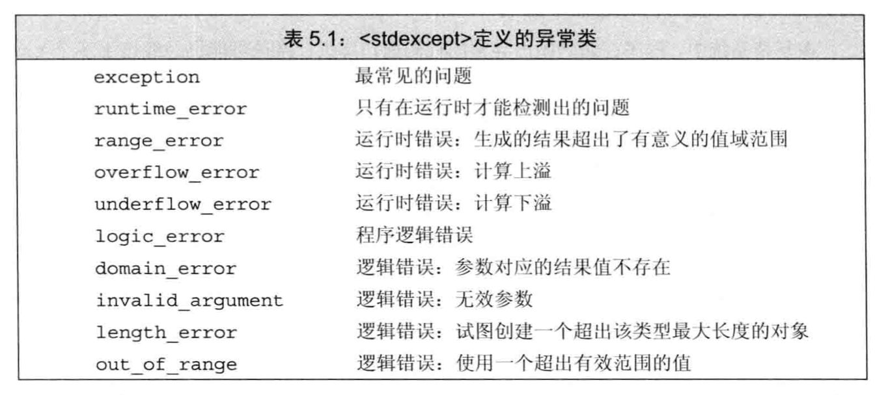

<h1 align="center">第五章 语句 学习笔记</h1>

- [1. 简单语句](#1-简单语句)
  - [1.1 空语句](#11-空语句)
  - [1.2 复合语句](#12-复合语句)
- [2. 语句作用域](#2-语句作用域)
- [3. 条件语句](#3-条件语句)
  - [3.1 `if`语句](#31-if语句)
  - [3.2 `switch`语句](#32-switch语句)
- [4. `迭代`语句](#4-迭代语句)
  - [4.1 `while`语句](#41-while语句)
  - [4.2 `for`语句](#42-for语句)
  - [4.3 `do...while`语句](#43-dowhile语句)
- [5. `跳转`语句](#5-跳转语句)
  - [5.1 `break`语句](#51-break语句)
  - [5.2 `continue`语句](#52-continue语句)
  - [5.3 `goto`语句](#53-goto语句)
- [6. `try`语句和异常处理](#6-try语句和异常处理)
  - [6.1 `throw`语句](#61-throw语句)
  - [6.2 `try`语句块](#62-try语句块)
  - [6.3 标准异常](#63-标准异常)

## 1. 简单语句
**`表达式语句`**：直接一个分号，一个表达式就直接构成一个表达式。

### 1.1 空语句
`空语句`只含有一个`单独分号`：
```cpp
; // 空语句
```
在程序的`某个位置`，语法上需要但逻辑上不需要的情况下使用。

```cpp
while (cin >> s && s != sought)
  ; // 空语句
```
在使用空语句时，加上注释，告知阅读者语句是有意省略。

### 1.2 复合语句
**`复合语句（compound statement）（也称为块）`**：指用`花括号`起来（可能为空）`语句`和`声明序列`。

- 一个块就是一个作用域。
- 在块内引入的名字只能在块内部以及嵌套在块中的子块访问使用。
- 块不以分号结束。

**`空块`**：内部没有任何语句的一对花括号。空块的作用等价于空语句。
```cpp
while (cin >> s &7 s != sought)
  { } // 空块
```

## 2. 语句作用域
- 结构内定义变量，在相应语句的内部可见，一旦语句结束，变量则超出作用范围。

## 3. 条件语句
C++中的两种按条件执行的语句
- if语句：根据条件决定控制流。
- switch语句：计算一个整型表达式的值，根据值从几个条件中选择其一执行。

### 3.1 `if`语句
判断一个指定的`条件是否为真`，根据判断结果决定是否执行另一条语句。

if语句中的语法形式：

```cpp
// 场景1：if语句
if (condition) // 为真则直接执行statement
  statement

// 场景2：包含else
if (condition) // 为真，则执行，否则执行 else语句
  statement1
else
  statement2

// 场景3：if ... else 嵌套
if (condition_01)
  statement_01
else if (condition_02)
  statement_02
else
  statement_03
```
- condition是一个`表达式`，所以必须使用`圆括号`括起来。
- 多个`if ... else 嵌套`，则规定`else`与`离它最近`尚未匹配的`if匹配`。

### 3.2 `switch`语句
可以在若个固定的选项中做出选择。

语法格式：

```cpp
switch (expression){
  case constant-expression :
    statement;
    break; // 可选
  case constant-expression :
    statement;
    break; // 可选
  ...
  default : // 可选
    statement;
}
```
- `expression` ：先对`表达式求值`么，紧跟在`switch语句后面`。
  - 可以是`初始化的变量声明`
- `case` 后面跟`常量表达式`，也就是和expression的值进行比较。
  - case必须是`整型常量表达式`。

- break语句，会直接`中断`当前控制流。
- default 标签
  - 没有任何一个case标签能匹配上 switch表达式的值。则执行default标签后的语句。
  - 

✅ 建议：一般不要省略case分支最后的 break语句，如果没写break语句，最好加上一段注释说清楚程序的逻辑。


- 如果在某处一个带有初始值的变量位于作用域之外，在另一处该变量位于作用域之内，则从前一处跳转到后一处的行为是不合规行为。

  ```cpp
  case true:
      // 因为程序的执行流程可能绕开下面的初始化语句，所以该switch语句不合法
      string file_name; // 错误：控制流绕过一个隐式初始化的变量
      int ival = 0; // 错误：控制流绕过一个显式初始化的变量
      int jval; // 正确：因为jval没有初始化
      break;
  case false:
      // 正确：jval虽然在作用域内，但是它没有被初始化
      jval = next_num(); // 正确：给jval赋一个值
      if (file_name.empty()) // file_name在作用域内，但是没有被初始化
            // ...
  ```

- 如果需要为某个case分支定义并初始化一个变量，则将变量定义在块内，从而确保后面的所有case标签都在变量的作用域内。

```cpp
case true:
    {
      // 正确：声明语句位于语句块内不
      // 局部作用域块
      string file_name = get_file_name();
      // ...
    }
    break;
case false:
  if (file_name.empty()); // 错误：file_name 不在作用域内
```

标签不应该孤零零出现，它后面必须跟上一个语句或者另外一个语句case标签。

如果switch结构以一个空的default标签作为结束，则该default标签后面必须跟上一条空语句或者一个空块。

## 4. `迭代`语句
迭代语句也称为循环。重复执行操作直到满足某个条件才停止。

- `while`和`for`语句在`执行循环体之前`检查条件
- `do while` 语句，`先执行循环体`，然后再检查条件。

### 4.1 `while`语句
只要条件为真，while语句就重复执行循环体。语法格式：

```cpp
while (condition) // condition 为真，则直接执行statement部分语句
  statement
```
- 如果定义在while语句condition部分或者循环体内的变量，每次迭代都会有一个从创建到销毁的过程。

### 4.2 `for`语句

- `传统for循环`语句语法格式：
  
  ```cpp
  for (init-statement; condition;expression)
    statement
  ```
  - init-statement必须满足三种形式之一：
    - 声明语句
    - 表达式语句
    - 空语句
  - condition 控制循环的条件
  - for语句头中的多重定义
    - 可以定义多个声明语句
    - 变量的类型必须相同。
  - 省略for语句头中的某个部分
  - 三个部分中的其中之一或者全部均可省略。


- `范围for`语句
  - 语法格式：
    ```cpp
    for (declaration : expression)
      statement
    ```
      - `declaration` 定义一个变量，序列中的每个元素都可以转成该变量的类型。
        - 确保类型相容，直接使用 `auto` 类型说明符。
      - `expression` 必须是一个`序列对象`。都是可以返回迭代器的`begin`和`end`成员。
        - 初始值列表
        - 数组
        - vector
        - string

  - C++11 新标准引入。
  - 可遍历容器或其他序列的所有元素。

  ```cpp
  vector<int> v = {0,1,2,3,4,5,6,7,8,9};
  for (auto &r : v) 
    r *= 2; // 遍历每个元素后翻倍
  ```

### 4.3 `do...while`语句
语法格式：

```cpp
do
  statement
while (condition);
```

- `do while` 语句应该在括号包围起来的条件语句后面用一个分号表示语句结束。
- `conditon不能为空`。如果condition为false，则直接终止循环。
- `conditon`使用的变量`必须定义在循环体外`。

## 5. `跳转`语句
- 跳转语句`中断`当前的执行过程。
- C++中提供的4种跳转语句：
  - `break`
  - `continue`
  - `goto`
  - `return` 

### 5.1 `break`语句
`终止离它最近`的`while`、`do...while`、`for`或`switch语句`，并从语句后的第一条开始继续执行。

break语句只能出现在`迭代语句`或`switch语句内部`。

break语句作用范围仅限于`最近的循环`或者`switch`。

### 5.2 `continue`语句
终止最近的`循环中的当前迭代`并立即`开始下一次迭代`。

- 出现在循环（包括嵌套）语句或块的内部。
- 只`中断当前迭代`，仍然会`继续执行循环`。

### 5.3 `goto`语句
从goto语句`无条件跳转`到同一个函数内的`另一条语句`。

语法格式：
```cpp
goto label;
// label 标识一条语句的标识符。
```

⚠️注意：尽量不要在程序中使用goto语句，可读性和可维护性较差。

## 6. `try`语句和异常处理
异常是指存在于运行时的反常行为。

异常处理机制为程序中异常检测和异常处理两部分的协作提供支持。在C++语言中，异常处理包括：
- throw表达式
- try语句块
- 一套异常类（exception class）

### 6.1 `throw`语句
- 程序的`异常检测`部分使用 `throw` 表达式`引发`一个`异常`。
- `throw表达式`包含关键字 `throw` 和紧随其后的`一个表达式`。
  - 表达式的类型：抛出的异常类型
  - 表达式后面紧跟分号

```cpp
if (item1.isbn() != item2.isbn()))
  throw runtime_error("Data must refer to same ISBN");
cout << item1 + item2 << endl;
```

类型`runtime_error` 是标准库异常类型的一种，定义在 `stdexcept头文件`中。

### 6.2 `try`语句块
try语句块的通用形式：

```cpp
try {
  program-statements // 正常程序的逻辑
}catch (exception-declaration) { // 对象的声明，也叫做异常声明，catch语句主要用来捕获异常情况
    handler-statements
}catch (exception-declaration) {
  handler-statement
} // ...
```

### 6.3 标准异常
在C++标准中定义了一组类，用于报告标准库函数遇到的问题。主要定义在4个头文件中：
- exception：定义了最通用的异常类exception，只报告异常的发生，不提供任何额外信息。
- stdexcept：定义了常用的异常类。
  
  

- new：定义了bad_alloc异常类型。
- type_info：定义了bad_cast 异常类型。

