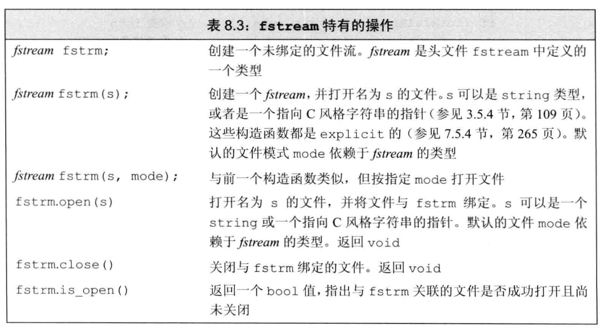
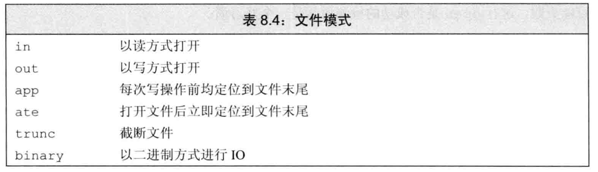
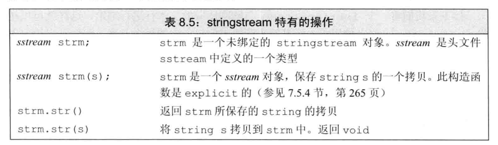

<h1 align="center">第 08 章 IO库 学习笔记</h1>

- [1. IO类](#1-io类)
  - [1.1 IO对象无拷贝或赋值](#11-io对象无拷贝或赋值)
  - [1.2 条件状态](#12-条件状态)
  - [1.3 管理输出缓冲](#13-管理输出缓冲)
- [2. 文件输入](#2-文件输入)
  - [2.1 使用文件流对象](#21-使用文件流对象)
  - [2.2 文件模式](#22-文件模式)
- [3. string流](#3-string流)
  - [3.1 使用istringstream](#31-使用istringstream)
  - [3.2 使用ostringstream](#32-使用ostringstream)
- [4. 总结](#4-总结)


## 1. IO类
C++不直接处理输入输出，而是通过一组定义在标准库中的类型来处理IO。

为了支持不同种类的IO处理操作，在 `istream` 和 `ostream` 之外，标准库另外定义了一些IO类型。主要定义在三个独立的头文件中：
- `iostream`：定义了用于读写流的基本类型。
- `fstream`：定义了读写命名文件的类型。
- `sstream`：定义了读写内存string对象的类型。

|头文件|类型|
|--|--|
|iostream||
||`isstream、wistream` 从流读取数据|
||`ostream、wostream` 向流中写入数据|
||`iostream、wiostream` 读写流|
|fstream||
||`ifstream、wifstream` 从文件中读写数据|
||`ofstream、wofstream` 向文件写入数据|
||`fstream、wfstream` 读写文件|
|sstream||
||`istringstream、wistringstream` 从string 读取数据|
||`ostringstream、wostringstream` 向string 写入数据|
||`stringstream、wstringstream` 读写string|

为了支持使用`宽字符`的语言，标准库定义了一组类型对象来操纵 `wchar_t` 类型的数据。`宽字符`版本的`类型`和`函数的名字`以一个 `w` 开始。

标准库之间通过继承机制的方式，可以使我们忽略不同类型流之间的差异。利用模板去使用具有继承关系的类，而不必去了解继承机制如何工作的细节。

继承机制使得可以声明一个特定的类`继承自`另一个类。通常可以将一个`派生类（继承类）对象`当作其`基类（所继承的类）对象`来使用。


`ifstream` 和 `istringstream` 都是继承自 `istream`。

### 1.1 IO对象无拷贝或赋值
- 不可以对IO对象进行拷贝或者赋值。

- 进行IO操作的函数通常以引用方式传递和返回流。

- 读写一个IO对象会改变其状态，因此传递和返回的引用不能是const类型。


### 1.2 条件状态
IO操作一个与生俱来的问题：可能会发生错误。所以IO类定义了一些函数和标志，帮助访问和操作流的条件状态。

|条件状态|描述|
|--|--|
|`strm::iostate`|strm 是一种IO类型，iostate 是一种机器相关的类型，提供了表达条件状态的完整功能。|
|`strm::badbit`| 用来指出流已经崩溃|
|`strm::failbit`|用来指出一个IO操作失败|
|`strm::eofbit`|用来指出流到达了文件结束|
|`strm::goodbit`|用来指出流未处于错误状态，此值保证为零|
|`s.eof()`|若流s的eofbit置位，则返回true|
|`s.fail()`|若流s的failbit或badbit置位，则返回true|
|`s.bad()`|若流s的badbit置位，则返回true|
|`s.good()`|若流s处于有效状态，则返回true|
|`s.clear()`|若流s中所有条件状态位复位，将流的状态设置为有效，返回void|
|`s.clear(flags)`|根据给定的flags标志位，将流s中对应条件状态位复位。flags的类型为`strm::iostate`，返回void|
|`s.setstate(flags)`|根据给定的flags标志位，将流s中对应条件状态位复位。flags的类型为`strm::iostate`，返回void|
|`s.rdstate()`|返回流s的当前条件状态，返回值类型为 `strm::iostate`。|


### 1.3 管理输出缓冲
每个输出流都管理了一个缓冲区，用来保存程序读写的数据。通过缓冲机制，OS可以将程序的多个输出操作组合成一个单一的系统级写操作。

导致缓冲区刷新（即数据真正写到输出设备或文件）的原因有很多：
- 程序正常结束，作为main函数的return操作的一部分，缓冲区刷新被执行。
- 缓冲区满时，需要刷新缓冲，而后新的数据才能继续写入缓冲区。
- 可以操纵符如endl来显式刷新缓冲区。
- 在每个输出操作之后，可以用操纵符 unitbuf 设置流的内部状态，来清空缓冲区。默认情况下，对cerr是设置 unitbuf 的，因此写到cerr的内容都是立即刷新的。
- 一个输出流可能被关联到另一个流。当读写被关联的流时，关联到的流的缓冲区会被刷新。


对于几种方式的实例如下：
- 刷新输出缓冲区
  - 除了endl之外，IO中的两个操纵符也可以刷新缓冲区。
    - flush：可以刷新缓冲区，但是不输出任何额外的字符。
    - ends：向缓冲区插入一个空字符，然后刷新缓冲区。
    
    ```cpp
    cout << "hi!" << endl;  // 输出hi和一个换行，然后刷新缓冲区
    cout << "hi!" << flush; // 输出hi，然后刷新缓冲区，不附加任何额外字符
    cout << "hi!" << ends;  // 输出hi和一个空字符，然后刷新缓冲区
    ```

- `unitbuf` 和 `nounitbuf`操作符
  - `unitbuf`：告知流在后续的每次写操作之后都进行一次flush操作。
  - `nounitbuf`：重置流，使其恢复使用正常的系统管理的缓冲区刷新机制。
  
    ```cpp
    cout << unitbuf;        // 所有输出操作后都会立即刷新缓冲区
    cout << nounitbuf;      // 回到正常的缓冲方式
    ```

- 关联输入/输出流
  - 交互式系统通常应该关联输入和输出流。所有的输出，包括用户提示信息，都会在读操作之前被打印出来。


## 2. 文件输入




### 2.1 使用文件流对象
当要读写一个文件时，可以定义一个文件流对象，并将对象与文件关联起来，每个文件流类都定义了一个名为open的成员函数，完成一些系统相关的操作，来定位给定的文件，并视情况打开为读或写模式。

在C++标准中，`文件名`既可以是`库类型string对象`，也可以是`C风格字符数组`。

- 用`fstream`代替 `iostream&`
  - 接受一个 `iostream 类型引用（或指针）`参数的函数，可以用一个对应的 `fstream(或sstream)类型`来调用。


- 成员函数 `open` 和 `close`
  - 如果定义了一个空文件流对象，可以随后调用open将其与文件关联起来。
    ```cpp
    ifstream in(ifile);         // 构建一个ifstream并打开给定文件
    ofstream out;               // 输出文件流未与任何文件相关联
    out.open(ifile + ".copy");  // 打开指定文件

    // ......
    in.close();                 // 关闭文件
    // 在关闭操作结束后，可以继续打开新的文件
    ```
  - 如果文件open失败，failbit会置位。可以通过如下方式检测成功。
    ```cpp
    if (out == true)
    {
        // 打开成功。继续执行
    } else {
        // 直接return退出
    }
    ```

- 自动构造和析构
  - 当一个fstream对象离开其作用域时，与之关联的文件会自动关闭。
  - 当一个fstream对象被销毁时，close会自动被调用。


### 2.2 文件模式
每一个流都有一个关联的文件模式（file mode），用来指出如何使用文件。



无论何种方式打开文件，都可以指定文件模式，调用open打开文件时或者用一个文件名初始化流来隐式打开文件时等等。

但是，指定文件模式时要注意几个限制点：
- 只可以对 `ofstream` 或者 `fstream` 对象设定`out`模式。
- 只可以对 `ifstream` 或者 `fstream` 对象设定`in`模式。
- 只有当`out`也被`设定`时，才可设定`trunc`模式。
- 只要 `trunc 没被设定`，即可`设定app`模式。
  - 在app模式下，即使`没有显式指定out`模式，文件总是以`输出方式被打开`。
- 默认情况下，`没有指定trunc`，以`out模式`打开的文件会`被截断`。
- `ate` 和 `binary` 模式都可用于任何类型的文件流对象，且可以与任何文件模式组合使用。

每个文件流类型都定义了一个默认的文件模式，如果未指定，则使用默认模式打开。
- `ifstream`： `in模式`
- `ofstream`： `out模式`
- `fstream`：`in模式` 和 `out模式`

在打开文件时，需要注意两个点：
- 以`out模式`打开文件时`会丢弃已有的数据`
  - 默认情况下，打开一个 ofstream时，文件的内容会被丢弃。
    - 阻止ofstream清空给定文件内容的方法：
      - 同时指定 app模式。
  ```cpp
  // file1 会被截断
  ofstream out1("file1");                   // 隐含以输出模式打开文件并截断文件
  ofstream out2("file1", ofstream::out);   // 隐含地截断文件
  // 保留文件内容，必须显式指定app模式
  ofstream app("file2", ofstream::app);     // 隐含为输出模式
  ofstream app("file2", ofstream::out | ofstream::app);
  ```

- 每次调用`open`时都会`确定文件模式`
  - 打开文件时，都需要指定文件模式（显式或者隐式指定）。
  - 如果`未指定`文件模式，则会隐式地以默认值 `out模式` 打开。

## 3. string流
`istringstream` 从string `读取` 数据，`ostringstream` 向string `写入` 数据，而头文件 `stringstream`既可从 string 读数据也可向string写数据。



sstream也是继承自 iostream中定义的类型。

### 3.1 使用istringstream
当处理行内的单个单词时，可以使用 `istringstream`。

实例：读取姓名和号码，一个人可能有一个号码或者多个号码。

```cpp
struct PersonInfo {
    string name;
    vector<string> phone;
};

string line, word;                    // 分别保存来自输入的一行和单词
vector<PersonInfo> people;            // 保存来自输入的所有记录

// 逐行从输入读取数据，直至cin遇到文件末尾（或者其他错误）
while (getline(cin, line))
{
    PersonInfo info;                  // 创建一个保存此记录数据的对象
    istringstream record(line);       // 将记录绑定到刚读入的行
    record >> info.name;              // 读取名字
    while (record >> word)            // 读取电话号码
    {
        info.phones.push_back(word);  // 保存
    }
    people.push_back(info);           // 将记录追加到people末尾
}
```

### 3.2 使用ostringstream
一般情况下，希望是逐步构造输出，最后一起打印。因此我们可以验证完所有的电话号码后才可进行输出操作。此时可以将输出内容写入到一个内存 ostringstream中。

```cpp
for (const auto &entry : people)                        // 对people中每一项
{
    ostringstream formatted, badNums;                   // 每个循环步创建的对象
    for (const auto &nums : entry.phones)               // 对每个数
    {
        if (!valid(nums)) {
            badNums << " " << nums;                     // 将数的字符串形式存入badNums
        } else {
            formatted << " " << format(nums);           // 将格式化的字符串“写入” formatted
        }

        if (badNums.str().empty())                      // 判断没有错误的数字
        {
            // 打印名字和格式化打印数字
            os << entry.name << " " << formatted.str() << endl;
        } else {
            cerr << "input  error : " << entry.name
                 << " invalid number(s) " << badNums.str() << endl;
        }
    }
}
```

## 4. 总结
每个IO对象都维护一组条件状态，用来指出此对象上是否可以进行IO操作。如果遇到了错误，标准库也提供了一组函数，用来设置和检测这些状态。

